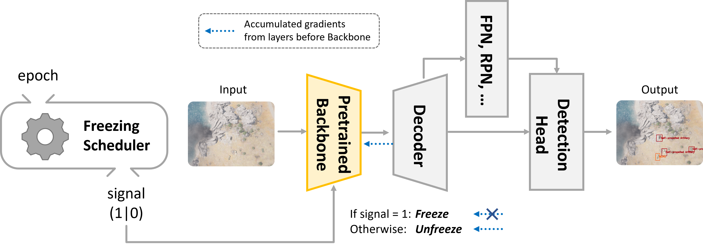

<h1 align="center" style="font-weight: 500; line-height: 1.4;">
  Dynamic Backbone Freezing 
</h1>

  
  
  
  
  

  <b><a href="https://github.com/unique-chan">Yechan Kim</a></b>
  <b><a href="https://github.com/unique-chan">JongHyun Park</a></b>
  <b><a href="https://github.com/unique-chan">Moongu Jeon</a></b>

### This repo includes:
- Official implementation of our proposed approach

### Overview:
- This work presents a training strategy coined `Dynamic Backbone Freezing` that aims to achieve two distinct goals in remote-sensing object detection: **resource-saving** and **robust prediction**.

  - Specifically, this work implements and utilizes **Freezing Scheduler** to dynamically control the update of backbone features during training.

### Preliminaries:
- Install all necessary packages listed in the `requirements.txt`. 
- Modify your base detector code as follows:
  - Declare an attribute named `bool_freeze_backbone` (boolean variable);
  - Modify `extract_feat()` to be dynamically locked / unlocked by `bool_freeze_backbone`. 
- Or you can easily run this code instead (only once): `python my_src/preliminaries/overwrite_base_models.py`
~~~
# example: mmdetection 2.x ➡️ mmdet/models/detectors/single_stage.py

class SingleStageDetector(...):

  def __init__(...):
    self.bool_freeze_backbone = False
    ...
  
  def extract_feat(...):
    x = self.backbone(img)
    if self.with_neck:
      if self.bool_freeze_backbone:  x = self.neck(tuple([_.detach() for _ in x]))
      else:                          x = self.neck(x)
    else:
      if self.bool_freeze_backbone:  
          if type(x) is tuple:       x = tuple([_.detach() for _ in x])
          else:                      x = x.detach()
    return x
  
  ...
~~~
- For experiments on your own dataset and detection model, prepare your own configuration file in `my_src/my_cfg`. (See `README.md` in `my_src/my_cfg` for details.)

### Training via our strategy:
- If you want to freeze the backbone only at every 20 epoch during training with 100 epochs:
~~~
python train.py --model-config "mmdetection/configs/faster_rcnn/faster_rcnn_r50_fpn_1x_coco.py" \
                --dataset-class "my_src/my_dataset/amod_v1.py" \
                --data-config "my_src/my_cfg/cfg_for_data_AMOD_v1.py" \
                --train-config "my_src/my_cfg/cfg_for_train_yechankim.py" \
                --dbf "my_src/my_trainer/DBF_step_interval.py" \
                --dbf-options "{'steps': [i for i in range(1, 100, 20)]}" \
                --data-root "mock_AMOD_v1" --epochs 100 --work-dir "." --gpu-id 0 --init_weights
~~~
  - Please check given examples for `data-config` and `train-config` for your experiments.
  - Also, see `my_src/my_cfg/parser.py` for detailed information about parsing arguments.

### Test:
- We recommend you to use the default python file for test provided by open-mmlab as follows:
~~~
python mmdetection/tools/test.py "work_dirs/exp-yechankim/cfg.py" \
                                 "work_dirs/exp-yechankim/best_map.pth" \
                                 --out "out.pkl"
~~~
  - Here, we assume that "work_dirs/exp-yechankim/cfg.py" is a dumped config file after running `train.py` in the working directory.
  - "work_dirs/exp-yechankim/best_map.pth" is a model weight file after training.

### Announcement:
- Code under construction.
